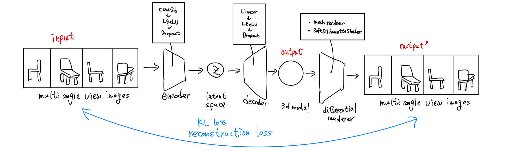
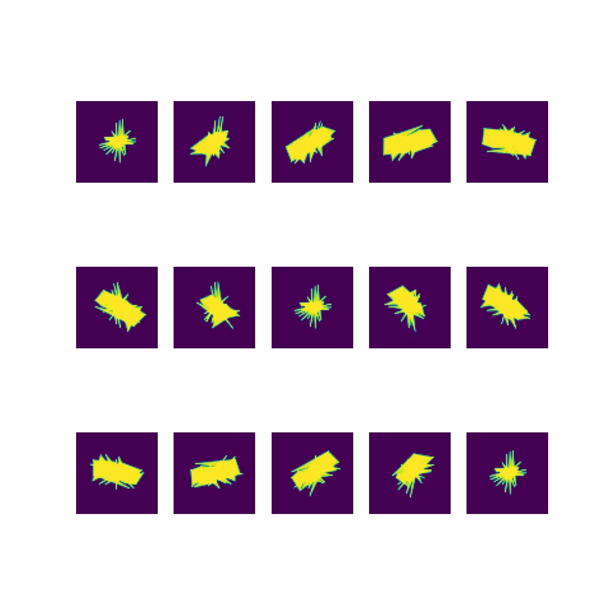

## abstract

This is a 3d model generator VAE model. The following diagram show the simple architecture.  I used Pytorch3d as a differential render and as shown in the figure, inputs and outputs of the model are image so simply, I used L2_loss and KL divergence for training.

**Unfortunately, this model can't generate high quality 3d mesh, please let me know if you have any good ideas or find my mistakes.**

The following figure is the generated 3d model rendering results after 100000 times train loops.

## setup

* pytorch : 1.9.0+cu102
* pytorch3d : how to setup >> [official site](https://pytorch3d.org/)

You can run on google colalb.

