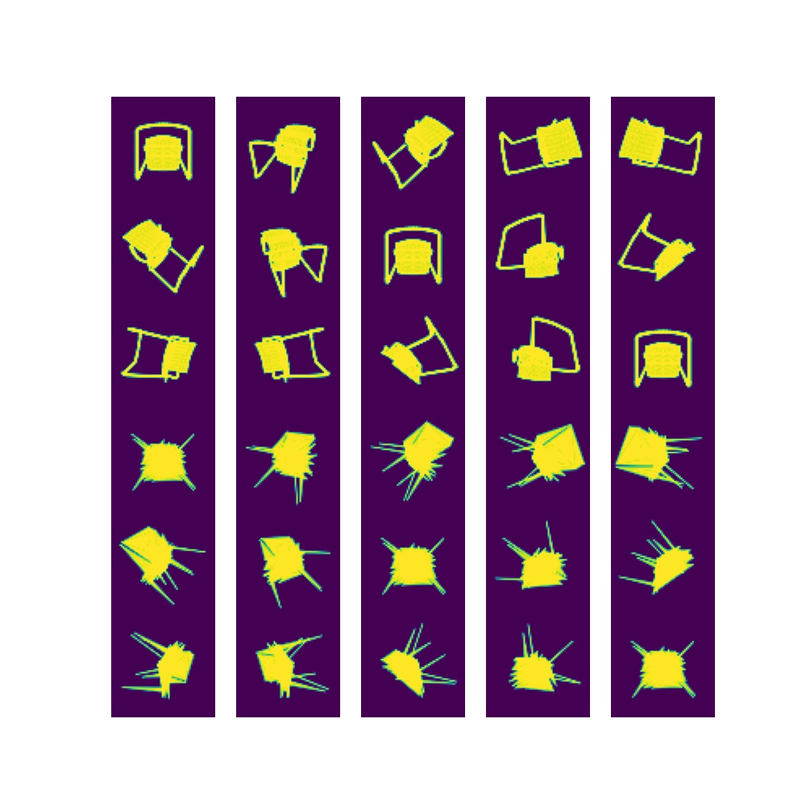

## Abstract

This is a 3d model generator VAE model. The following diagram show the simple architecture.  I used Pytorch3d as a differential render and as shown in the figure, inputs and outputs of the model are image so simply, I used L2_loss and KL divergence for training.

**Unfortunately, this model can't generate high quality 3d mesh, please let me know if you have any good ideas or find my mistakes.**

The following figures are the generated 3d model rendering results after 100000 times train loops. Top 3x5 images are input multi angel view images, bottom 3x5 images are generated 3d model rendered multi angle view images.

The following figures are the are generated 3d model rendered multi angle view images from sampled Z values in latent space after 10000 times train loops.

 

 

 

## Setup

* pytorch : 1.9.0+cu102
* pytorch3d : how to setup >> [official site](https://pytorch3d.org/)

You can run it on google colab.

## Download train datasets

I used 3d model dataset from modelnet. You can download datasets [here](http://modelnet.cs.princeton.edu/#). I used chairs 3d model dataset from ` 10-Class Orientation-aligned Subset`. 

* modelnet : http://modelnet.cs.princeton.edu/#

